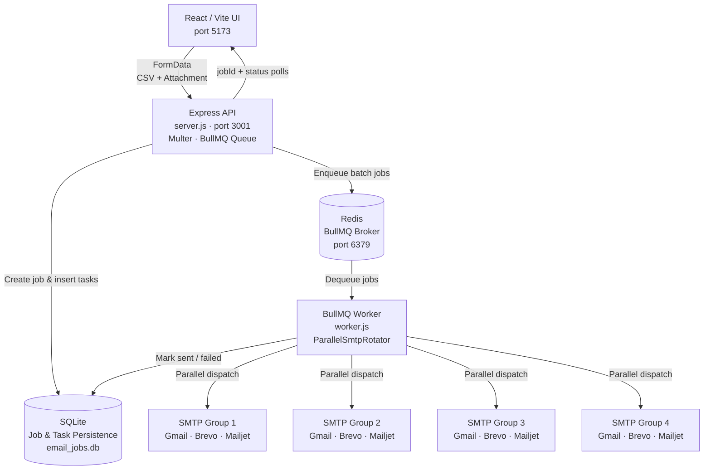

# MailGun — High-Performance Bulk Email Platform

A queue-driven, multi-provider bulk email application built for scale. Upload a CSV of recipients, compose your message, optionally attach a file (e.g. a résumé/PDF), and dispatch thousands of personalised emails concurrently — all tracked in real time from a live dashboard.

Key capabilities:
- **Multi-provider SMTP rotation** across up to 4 parallel groups (Gmail · Brevo · Mailjet), each with independent daily quota tracking
- **BullMQ + Redis** job queue for reliable, resumable background processing — the API returns immediately and a separate worker handles sending
- **SQLite persistence** — every email task is stored on disk; jobs survive worker restarts and can be paused, resumed, or stopped mid-flight
- **File attachment support** — attach a single file (PDF, DOCX, etc.) to every email in the campaign
- **Live dashboard** — per-provider capacity bars, job progress %, sent/failed/pending counters, and pause/resume/stop controls

---

## System Architecture



### Tech Stack

| Layer | Technology |
|---|---|
| Frontend | React 19, Vite 8, Vanilla CSS |
| API Server | Node.js, Express 4, Multer |
| Job Queue | BullMQ 5, ioredis 5 |
| Queue Broker | Redis 7 |
| Database | SQLite (better-sqlite3 via `sql.js`) |
| Email Sending | Nodemailer 6 |
| CSV Parsing | csv-parser |

---

## Prerequisites

| Requirement | Notes |
|---|---|
| **Node.js ≥ 18** | Uses ES Modules (`"type": "module"`) and top-level `await` |
| **Redis 7** | Must be reachable at `127.0.0.1:6379` (or configure via `.env`) |
| **SMTP credentials** | At least one provider configured in `backend/.env` |

---

## Project Structure

```
email/
├── backend/
│   ├── server.js          # Express API — enqueues jobs, serves status endpoints
│   ├── worker.js          # BullMQ worker — pulls jobs and sends emails
│   ├── smtpRotator.js     # Multi-provider SMTP pool with per-group parallelism
│   ├── db.js              # SQLite schema, queries, and helpers
│   ├── abortRegistry.js   # AbortController registry for pause/stop signals
│   ├── reset-smtp.mjs     # One-shot script to reset daily SMTP quotas
│   ├── .env               # ← you configure this (see below)
│   └── uploads/           # Temporary storage for uploaded CSV & attachment files
└── frontend/
    └── src/
        ├── App.jsx         # Main application component
        └── App.css         # Design system + component styles
```

---

## Setup & Running

### 1 — Start Redis

Redis is required before starting the backend. The easiest approach is Docker:

```bash
docker run -d -p 6379:6379 redis:7-alpine
```

> Alternatively, install Redis locally and run `redis-server`.

---

### 2 — Install Dependencies

Run `npm install` separately in both directories:

```bash
# Backend
cd backend
npm install

# Frontend
cd frontend
npm install
```

---

### 3 — Configure Environment Variables

Copy the template into `backend/.env` and fill in your SMTP credentials.  
The system supports up to **4 parallel groups**, each containing up to 3 providers (Gmail, Brevo, Mailjet).

### 4 — (Optional) Reset SMTP Daily Quotas

If the database already has send-count records from a previous run and you want to reset all daily quotas to zero:

```bash
cd backend
node reset-smtp.mjs
```

---

### 5 — Start the API Server

In a terminal inside the `backend/` directory:

```bash
npm run dev
```

The server starts on **http://localhost:3001** and prints all configured SMTP providers on startup.


---

### 6 — Start the BullMQ Worker

**In a separate terminal** (the worker is a distinct Node process):

```bash
cd backend
npm run worker
```

The worker connects to Redis, initialises SQLite, and begins polling for jobs. You will see a startup banner listing all active SMTP groups and their daily capacities.

> Both the API server and the worker must be running simultaneously for email sending to work. The API enqueues jobs; the worker processes them.

---

### 7 — Start the Frontend

In a third terminal inside the `frontend/` directory:

```bash
npm run dev
```

The UI is served at **http://localhost:5173**.

---

## Using the Application

1. **Upload a CSV** — Drag-and-drop or browse for a `.csv` file. Required columns: `name`, `email`. A live preview of the first 200 rows appears immediately.
2. **Write your subject and message** — The live preview panel updates in real time showing exactly how the email will be formatted for the first recipient.
3. **Attach a file (optional)** — Click the attachment zone to select a PDF, DOCX, or any other file to include as an attachment in every email.
4. **Click EXECUTE** — The CSV is streamed and chunked into SQLite; BullMQ jobs are enqueued; the worker begins sending concurrently across all active SMTP groups.
5. **Monitor progress** — The Execution Monitor shows live % progress, sent/failed/pending counts, and the SMTP Provider Cluster panel shows per-provider quota usage.
6. **Pause / Resume / Stop** — Use the control buttons to pause mid-campaign (picks up where it left off on resume) or stop it entirely.

---

## API Endpoints

| Method | Path | Description |
|---|---|---|
| `POST` | `/api/parse-csv` | Preview-parse a CSV and return up to 200 rows |
| `POST` | `/api/upload-job` | Accept CSV + optional attachment, create job, start sending |
| `GET` | `/api/status/:jobId` | Live status for a specific job |
| `GET` | `/api/jobs` | List all recent jobs |
| `GET` | `/api/smtp-stats` | Per-provider quota usage |
| `POST` | `/api/jobs/:jobId/pause` | Pause a running job |
| `POST` | `/api/jobs/:jobId/resume` | Resume a paused job |
| `POST` | `/api/jobs/:jobId/stop` | Stop and abandon a job |
